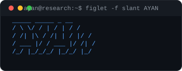
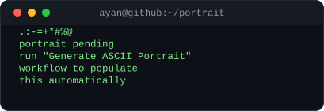
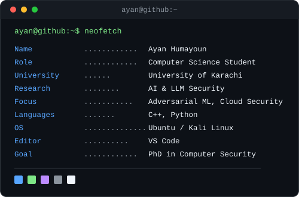
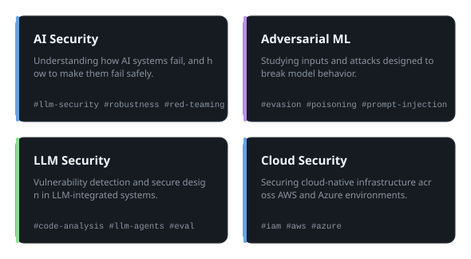
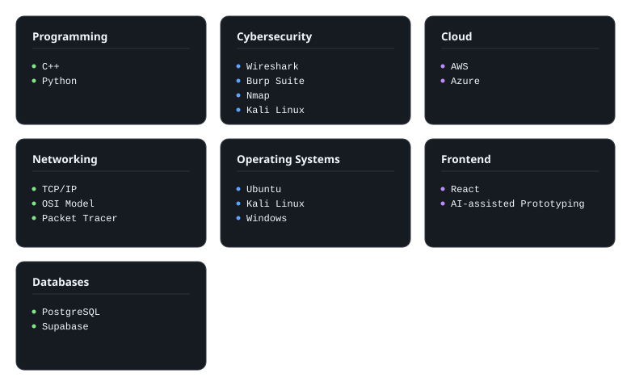
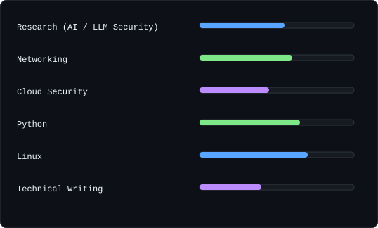
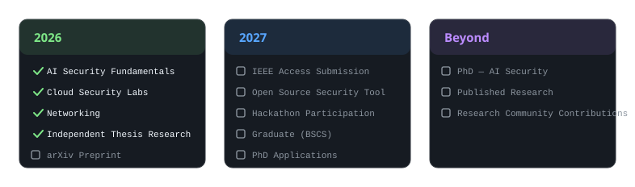

<div align="center">



<br/>

**Computer Science Student · Aspiring AI Security Researcher**
<br/>
University of Karachi — expected Dec 2027

<br/>


</div>

<br/>

<div align="center">

<table>
<tr>
<td width="50%" valign="top">



<sub>Auto-regenerated weekly by <a href="./.github/workflows/ascii-portrait.yml">GitHub Action</a> — see <a href="./assets/portrait">setup</a>.</sub>

</td>
<td width="50%" valign="top">



</td>
</tr>
</table>

</div>

<br/>

## About

I'm a 5th-semester BSCS student at UBIT, University of Karachi, working toward a fully funded PhD in AI Security for Fall 2028. My current focus is independent research on LLM-assisted source code vulnerability detection, alongside hands-on work in adversarial ML, cloud security, and secure system design.

I learn by building — small tools, research prototypes, and write-ups that document what I find along the way. Long term, I want to contribute meaningful, publishable research to AI security and eventually build a company around it.

<br/>

## Current Focus

```text
ayan@research:~$ cat current-focus.txt

  → Independent thesis: LLM-assisted source code vulnerability detection
  → Targeting an arXiv preprint + IEEE Access journal submission
  → Progressing through TryHackMe's AI Security learning path
  → Preparing for hackathon participation (AI security angle)
  → Documenting the journey in public — writeups, notes, LinkedIn
```

<br/>

## Research Interests

<div align="center">

</div>

<br/>

## Tech Stack

<div align="center">

</div>

<br/>

## Skills Dashboard

<div align="center">

</div>

<sub>Visual self-assessment, not a certification — a rough sense of where time has gone.</sub>

<br/>

## Featured Projects

<table>
<tr>
<td width="50%" valign="top">

**LLM-Assisted Vulnerability Detection** <sub>`research`</sub>

Independent thesis research (with Syed Shabahat Hussain) evaluating LLMs for source code vulnerability detection, targeting an arXiv preprint and IEEE Access submission.

`Research` · `AI Security` · `Static Analysis`

</td>
<td width="50%" valign="top">

**DocMind AI** <sub>`shipped`</sub>

A RAG-based PDF Q&A chatbot — semantic search over documents with a conversational interface.

`Gemini Flash API` · `FAISS` · `Sentence-Transformers` · `PyMuPDF` · `Streamlit`

</td>
</tr>
<tr>
<td width="50%" valign="top">

**FRIDAY** <sub>`in progress`</sub>

A fully local, multi-agent personal AI assistant with a wake-word interface and Google-services integration.

`Multi-Agent Systems` · `OpenRouter` · `Local-First AI`

</td>
<td width="50%" valign="top">

**Codekar** <sub>`building`</sub>

Co-founded cohort-based workshops teaching non-technical people to build real AI products using vibe-coding tools.

`Applied AI` · `Education` · `Product`

</td>
</tr>
</table>

<sub>Repository links go here once each project has a public repo — replace the placeholders in the source Markdown.</sub>

<br/>

## Certifications & Learning

**TryHackMe** — AI Security path: AI/ML Security Threats · Prompt Engineering · AI Forensics · LLM Security · AI Threat Modelling

**CyberWarfare Labs** — Microsoft AI Red Teaming webinar

**GDG On Campus × IEEE × Way to Cyber** — Cybersecurity bootcamp

<br/>

## Practical Experience

```text
ayan@research:~$ tree experience/

experience/
├── tryhackme/            AI Security learning path, ongoing
├── labs/                 Home-lab experimentation, packet analysis
├── bootcamps/            GDG × IEEE × Way to Cyber, CyberWarfare Labs
└── coursework/           AI · OS · HCI · Compilers · InfoSec (UBIT)
```

<br/>

## Writing

Technical notes, TryHackMe writeups, and research documentation — most of it written while learning something new. The independent thesis on LLM vulnerability detection is in progress toward an arXiv preprint.

<br/>

## Research Roadmap

<div align="center">

</div>

<br/>

## GitHub Metrics

<div align="center">


<br/>


<br/>

<picture>
  <source media="(prefers-color-scheme: dark)" srcset="https://raw.githubusercontent.com/ayan-humayoun56/ayan-humayoun56/output/snake-dark.svg" />
  <source media="(prefers-color-scheme: light)" srcset="https://raw.githubusercontent.com/ayan-humayoun56/ayan-humayoun56/output/snake-light.svg" />
  
</picture>

</div>

<br/>

## Connect

<div align="center">

[](mailto:ayanhumayoun1@gmail.com)
[](https://linkedin.com/in/https://www.linkedin.com/in/ayan-humayun-02940b3a3/)
[](https://github.com/ayan-humayoun56)

</div>

<br/>

<div align="center">
<sub>

"The purpose of computing is insight, not numbers." — Richard Hamming

</sub>
</div>

<div align="center">

</div>
